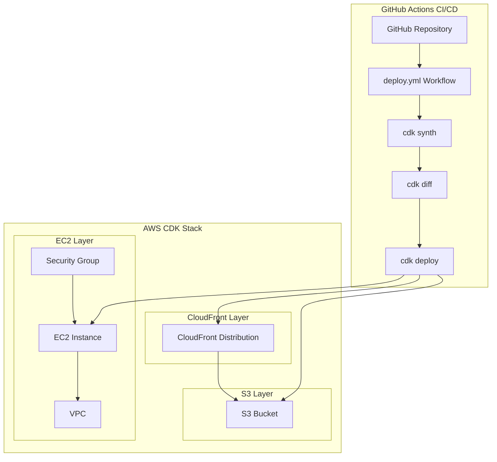
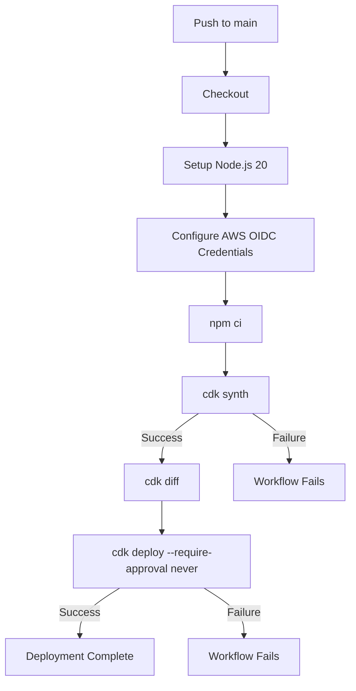

# 技術設計書

## Overview

本設計書は、AWS DevOps Agentの障害調査能力を検証するためのCDKテストプロジェクトの技術設計を定義する。プロジェクトはTypeScript + AWS CDK v2で構成され、CloudFront・S3・EC2のシンプルなアーキテクチャ上に、CDK初心者が陥りやすい13個の設定ミスパターンを意図的に仕込む。

### 設計方針

1. **障害パターンの検出容易性**: 各Fault Patternが独立したConstruct IDを持ち、DevOps Agentが特定のリソースと設定ミスを明確に紐付けられるようにする
2. **シンプルな構造**: 単一Stack構成とし、CDK初心者にとって理解しやすい構造を維持する
3. **合成可能性の維持**: 全ての障害パターンを含んだ状態で`cdk synth`が成功すること（デプロイ時またはランタイムで障害が発現する設計）
4. **教育的価値**: コード内のコメントとドキュメントにより、各障害パターンの学習ポイントが明確に伝わる

## Architecture

### 全体構成図



### ディレクトリ構成

```
cdk-devops-agent-testing/
├── bin/
│   └── app.ts                         # CDKアプリケーションエントリポイント
├── lib/
│   └── devops-agent-testing-stack.ts  # メインStack定義（全障害パターン含む）
├── test/
│   └── devops-agent-testing-stack.test.ts  # スナップショット・アサーションテスト
├── docs/
│   └── fault-patterns.md              # 障害パターンドキュメント（日本語）
├── .github/
│   └── workflows/
│       └── deploy.yml                 # GitHub Actions CI/CDワークフロー
├── cdk.json                           # CDK設定ファイル
├── package.json                       # Node.js依存関係
├── tsconfig.json                      # TypeScript設定
└── README.md                          # プロジェクト概要・障害パターン一覧
```

## Components and Interfaces

### 1. CDKアプリケーションエントリポイント (`bin/app.ts`)

CDKアプリのブートストラップを担当する。

```typescript
import * as cdk from 'aws-cdk-lib';
import { DevopsAgentTestingStack } from '../lib/devops-agent-testing-stack';

const app = new cdk.App();
new DevopsAgentTestingStack(app, 'DevopsAgentTestingStack', {
  env: {
    account: process.env.CDK_DEFAULT_ACCOUNT,
    region: process.env.CDK_DEFAULT_REGION,
  },
});
```

### 2. メインStack定義 (`lib/devops-agent-testing-stack.ts`)

全リソースと13個の障害パターンを含む単一Stack。以下のリソースグループで構成される。

#### S3リソースグループ

| Construct ID | リソース | 障害パターン |
|---|---|---|
| `FaultBucketNoOac` | S3 Bucket | OAI/OAC未設定、BlockPublicAccess.BLOCK_ALL、removalPolicy未設定、autoDeleteObjects未設定 |
| (同上 BucketPolicy) | Bucket Policy | ハードコードアカウントID (`123456789012`) |

**設計決定**: S3バケットは単一のConstructとし、複数の障害パターンを1つのバケットに集約する。これはCDK初心者が実際に遭遇する「1つのリソースに複数の問題が重なる」状況を再現するためである。

#### CloudFrontリソースグループ

| Construct ID | リソース | 障害パターン |
|---|---|---|
| `FaultDistributionNoRootObject` | CloudFront Distribution | HttpOriginによるS3アクセス、defaultRootObject未設定、エラーハンドリング不適切(403/404→200)、ViewerProtocolPolicy.ALLOW_ALL |

**設計決定**: CloudFront Distributionは単一Constructとし、複数の障害パターンを重ねる。DevOps Agentが複合的な問題を分析する能力の検証も兼ねる。

#### EC2リソースグループ

| Construct ID | リソース | 障害パターン |
|---|---|---|
| `FaultSgOpenSsh` | Security Group | SSH 0.0.0.0/0 + アウトバウンド全開放 |
| `FaultEc2HardcodedAmi` | EC2 Instance | ハードコードAMI ID、パブリックサブネット+EIP無し、IAMロール未付与 |

#### Stack実装概要

```typescript
export class DevopsAgentTestingStack extends cdk.Stack {
  constructor(scope: Construct, id: string, props?: cdk.StackProps) {
    super(scope, id, props);

    // === VPC ===
    const vpc = new ec2.Vpc(this, 'Vpc', { maxAzs: 2 });

    // === S3 Bucket (Fault Patterns: FP-S3-001〜005) ===
    const bucket = new s3.Bucket(this, 'FaultBucketNoOac', {
      websiteIndexDocument: 'index.html',
      blockPublicAccess: s3.BlockPublicAccess.BLOCK_ALL,
      // removalPolicy未指定 → RETAIN（FP-S3-003）
      // autoDeleteObjects未指定（FP-S3-004）
    });

    // ハードコードアカウントID（FP-S3-005）
    bucket.addToResourcePolicy(new iam.PolicyStatement({
      actions: ['s3:GetObject'],
      resources: [bucket.arnForObjects('*')],
      principals: [new iam.AccountPrincipal('123456789012')],
    }));

    // === CloudFront Distribution (Fault Patterns: FP-CF-001〜003) ===
    const distribution = new cloudfront.Distribution(this, 'FaultDistributionNoRootObject', {
      defaultBehavior: {
        origin: new origins.HttpOrigin(
          bucket.bucketWebsiteDomainName
        ),
        viewerProtocolPolicy: cloudfront.ViewerProtocolPolicy.ALLOW_ALL,
      },
      // defaultRootObject未指定（FP-CF-001）
      errorResponses: [
        { httpStatus: 403, responseHttpStatus: 200, responsePagePath: '/index.html' },
        { httpStatus: 404, responseHttpStatus: 200, responsePagePath: '/index.html' },
      ],
    });

    // === Security Group (Fault Patterns: FP-EC2-001〜002) ===
    const sg = new ec2.SecurityGroup(this, 'FaultSgOpenSsh', {
      vpc,
      allowAllOutbound: true, // FP-EC2-002
    });
    sg.addIngressRule(ec2.Peer.anyIpv4(), ec2.Port.tcp(22), 'SSH from anywhere');

    // === EC2 Instance (Fault Patterns: FP-EC2-003〜005) ===
    const instance = new ec2.Instance(this, 'FaultEc2HardcodedAmi', {
      vpc,
      instanceType: ec2.InstanceType.of(ec2.InstanceClass.T2, ec2.InstanceSize.MICRO),
      machineImage: ec2.MachineImage.genericLinux({
        'ap-northeast-1': 'ami-0abcdef1234567890',
      }),
      securityGroup: sg,
      vpcSubnets: { subnetType: ec2.SubnetType.PUBLIC },
      // IAMロール未指定（FP-EC2-005）
    });
    instance.addUserData('aws s3 ls');
  }
}
```

### 3. GitHub Actions Workflow (`.github/workflows/deploy.yml`)



**ワークフロー設定**:
- トリガー: `push` to `main`
- ランナー: `ubuntu-latest`
- Node.js: v20
- 認証: GitHub OIDC Provider (`aws-actions/configure-aws-credentials@v4`)
- ログ保持: 90日（GitHub Actionsデフォルト、30日以上の要件を満たす）

### 4. インターフェース定義

本プロジェクトは独立したCDKアプリケーションであり、外部APIやライブラリへのインターフェースは標準CDKライブラリのみ。

主要依存パッケージ:
- `aws-cdk-lib`: ^2.150.0
- `constructs`: ^10.0.0
- `typescript`: ^5.4.0
- `ts-node`: ^10.9.0
- `jest`: ^29.0.0
- `ts-jest`: ^29.0.0
- `aws-cdk`: ^2.150.0 (CLI, devDependency)

## Data Models

### 障害パターンマスターデータ

全13個の障害パターンの構造化定義。README.mdおよびdocs/fault-patterns.mdに反映する。

```typescript
interface FaultPattern {
  id: string;                    // パターン識別子 (例: "FP-S3-001")
  name: string;                  // パターン名
  category: 'deployment_failure' | 'runtime_error' | 'security_risk' | 'best_practice_violation';
  severity: 'Critical' | 'High' | 'Medium' | 'Low';
  difficulty: '初級' | '中級' | '上級';
  affectedResource: string;      // 影響を受けるリソース種別
  constructId: string;           // CDK Construct ID
  sourceFile: string;            // ソースコードファイルパス
  symptom: string;               // 観測される症状
  rootCause: string;             // 根本原因
  recommendedFix: string;        // 推奨修正方法
  learningObjective: string;     // 学習目標
  cfnProperty?: string;          // CloudFormation上の問題プロパティ
  nonCompliantValue?: string;    // 非準拠値
}
```

### 障害パターン一覧

| ID | パターン名 | カテゴリ | 重大度 | 難易度 | Construct ID |
|---|---|---|---|---|---|
| FP-S3-001 | OAI/OAC未設定 | runtime_error | High | 中級 | FaultBucketNoOac |
| FP-S3-002 | BlockPublicAccess競合 | runtime_error | High | 中級 | FaultBucketNoOac |
| FP-S3-003 | removalPolicy未設定 | deployment_failure | Critical | 初級 | FaultBucketNoOac |
| FP-S3-004 | autoDeleteObjects未設定 | deployment_failure | Critical | 初級 | FaultBucketNoOac |
| FP-S3-005 | ハードコードアカウントID | best_practice_violation | Low | 初級 | FaultBucketNoOac |
| FP-CF-001 | defaultRootObject未設定 | runtime_error | High | 中級 | FaultDistributionNoRootObject |
| FP-CF-002 | エラーハンドリング不適切 | runtime_error | Medium | 上級 | FaultDistributionNoRootObject |
| FP-CF-003 | ViewerProtocolPolicy.ALLOW_ALL | security_risk | Medium | 初級 | FaultDistributionNoRootObject |
| FP-EC2-001 | SSH全開放 (0.0.0.0/0) | security_risk | Medium | 初級 | FaultSgOpenSsh |
| FP-EC2-002 | アウトバウンド制限なし | best_practice_violation | Low | 中級 | FaultSgOpenSsh |
| FP-EC2-003 | ハードコードAMI ID | best_practice_violation | Low | 中級 | FaultEc2HardcodedAmi |
| FP-EC2-004 | パブリックサブネット+EIP無し | runtime_error | High | 中級 | FaultEc2HardcodedAmi |
| FP-EC2-005 | IAMロール未付与 | runtime_error | High | 中級 | FaultEc2HardcodedAmi |

### CDK Context設定 (`cdk.json`)

```json
{
  "app": "npx ts-node --prefer-ts-exts bin/app.ts",
  "watch": {
    "include": ["**"],
    "exclude": ["README.md", "cdk*.json", "**/*.d.ts", "**/*.js", "tsconfig.json", "package*.json", "node_modules", "docs"]
  },
  "context": {
    "@aws-cdk/core:enableStackTrace": true,
    "@aws-cdk/core:pathMetadata": true,
    "@aws-cdk/aws-apigateway:usagePlanKeyOrderInsensitiveId": true,
    "@aws-cdk/core:stackRelativeExports": true
  }
}
```

## Error Handling

### 障害パターンの発現タイミング分類

本プロジェクトの全ての障害パターンは`cdk synth`を通過する設計である。障害はデプロイ時またはランタイム時に発現する。

| 障害パターン | 発現タイミング | エラー内容 | DevOps Agent診断ポイント |
|---|---|---|---|
| FP-S3-001 | ランタイム | 403 Access Denied (CloudFront→S3) | OAI/OAC未設定の指摘 |
| FP-S3-002 | ランタイム | 403 Access Denied (BlockPublicAccess競合) | BlockPublicAccessとオリジン設定の矛盾指摘 |
| FP-S3-003 | スタック削除時 | DELETE_FAILED | removalPolicy設定の推奨 |
| FP-S3-004 | スタック削除時 | BucketNotEmpty | autoDeleteObjects設定の推奨 |
| FP-S3-005 | 別アカウントデプロイ時 | バケットポリシー不正 | Stack.of(this).account利用の推奨 |
| FP-CF-001 | ランタイム | ルートURL 403エラー | defaultRootObject設定の推奨 |
| FP-CF-002 | ランタイム | エラー隠蔽 (200返却) | 不適切なerrorResponses設定の指摘 |
| FP-CF-003 | セキュリティスキャン時 | HTTP平文通信可能 | REDIRECT_TO_HTTPS推奨 |
| FP-EC2-001 | セキュリティスキャン時 | SSH全世界公開 | CIDR制限の推奨 |
| FP-EC2-002 | セキュリティスキャン時 | 無制限アウトバウンド | 最小権限原則の推奨 |
| FP-EC2-003 | 別リージョンデプロイ時 | AMI not found | MachineImage.latestAmazonLinux2023()推奨 |
| FP-EC2-004 | EC2再起動時 | IPアドレス変更 | EIPまたはプライベートサブネット+NATの推奨 |
| FP-EC2-005 | ランタイム | AWS CLI権限エラー | IAMロール付与の推奨 |

### CI/CDパイプラインのエラーハンドリング

- **`cdk synth`失敗**: ワークフロー即座に終了（後続ステップ未実行）
- **`cdk deploy`失敗**: ワークフローFailure状態で終了、ログ90日保持
- **AWS認証エラー**: OIDC設定不備により即座に失敗
- **Node.js/依存関係エラー**: `npm ci`ステップで検出

### DevOps Agent診断のための情報提供設計

1. **Construct ID命名規則**: `Fault` プレフィックス + 障害パターン内容の英語記述
2. **CDK Metadata**: `enableStackTrace: true` によりソースコード行番号が追跡可能
3. **Path Metadata**: `pathMetadata: true` によりConstruct PathがCloudFormationテンプレートに記録
4. **論理ID一貫性**: CloudFormation Logical IDとCDK Construct IDの一対一対応を維持

## Testing Strategy

### PBT（Property-Based Testing）の適用判断

本プロジェクトはInfrastructure as Code（CDK）であり、宣言的な設定記述が主体である。テスト対象は「特定の設定値がテンプレートに存在すること」の検証であり、入力の変動により振る舞いが変わる純粋関数が存在しない。そのため、**Property-Based Testingは適用しない**。

代わりに以下のテスト手法を採用する：
- CDK Snapshot Tests（テンプレート全体の整合性）
- CDK Assertion Tests（個別障害パターンの存在検証）
- CI/CDパイプラインでの`cdk synth`検証

### テストフレームワーク

- **Jest** (v29): テストランナー・アサーション
- **ts-jest**: TypeScript直接実行
- **aws-cdk-lib/assertions**: CDKテンプレートアサーション（`Template`, `Match`クラス）

### テスト構成

#### 1. Snapshot Test（1テスト）

合成されたCloudFormationテンプレート全体のスナップショット。意図しない変更の検出用。

```typescript
test('Stack snapshot matches', () => {
  const app = new cdk.App();
  const stack = new DevopsAgentTestingStack(app, 'TestStack');
  const template = Template.fromStack(stack);
  expect(template.toJSON()).toMatchSnapshot();
});
```

#### 2. Assertion Tests（13テスト — 各障害パターンに1つ）

各障害パターンが正しくCloudFormationテンプレートに反映されていることを個別検証する。

```typescript
describe('S3 Fault Patterns', () => {
  test('FP-S3-001/002: S3 bucket has BLOCK_ALL with no OAC', () => {
    template.hasResourceProperties('AWS::S3::Bucket', {
      PublicAccessBlockConfiguration: {
        BlockPublicAcls: true,
        BlockPublicPolicy: true,
        IgnorePublicAcls: true,
        RestrictPublicBuckets: true,
      },
    });
    expect(template.findResources('AWS::CloudFront::OriginAccessControl')).toEqual({});
  });

  test('FP-S3-003: Bucket has no DeletionPolicy DESTROY', () => {
    const buckets = template.findResources('AWS::S3::Bucket');
    for (const key of Object.keys(buckets)) {
      expect(buckets[key].DeletionPolicy).not.toBe('Delete');
    }
  });

  test('FP-S3-005: Bucket policy contains hardcoded account ID', () => {
    template.hasResourceProperties('AWS::S3::BucketPolicy', {
      PolicyDocument: Match.objectLike({
        Statement: Match.arrayWith([
          Match.objectLike({
            Principal: Match.objectLike({
              AWS: Match.stringLikeRegexp('123456789012'),
            }),
          }),
        ]),
      }),
    });
  });
});

describe('CloudFront Fault Patterns', () => {
  test('FP-CF-001: Distribution has no DefaultRootObject', () => {
    const distributions = template.findResources('AWS::CloudFront::Distribution');
    for (const key of Object.keys(distributions)) {
      const config = distributions[key].Properties.DistributionConfig;
      expect(config.DefaultRootObject).toBeUndefined();
    }
  });

  test('FP-CF-003: Distribution uses allow-all', () => {
    template.hasResourceProperties('AWS::CloudFront::Distribution', {
      DistributionConfig: Match.objectLike({
        DefaultCacheBehavior: Match.objectLike({
          ViewerProtocolPolicy: 'allow-all',
        }),
      }),
    });
  });
});

describe('EC2 Fault Patterns', () => {
  test('FP-EC2-001: Security Group allows SSH from 0.0.0.0/0', () => {
    template.hasResourceProperties('AWS::EC2::SecurityGroup', {
      SecurityGroupIngress: Match.arrayWith([
        Match.objectLike({
          IpProtocol: 'tcp',
          FromPort: 22,
          ToPort: 22,
          CidrIp: '0.0.0.0/0',
        }),
      ]),
    });
  });

  test('FP-EC2-003: Instance uses hardcoded AMI ID', () => {
    template.hasResourceProperties('AWS::EC2::Instance', {
      ImageId: 'ami-0abcdef1234567890',
    });
  });
});
```

#### 3. CI/CDでのテスト実行

GitHub Actionsワークフロー内で `npm test` および `cdk synth` を実行し、全テストが通過することを確認する。

### テスト実行コマンド

```bash
# 全テスト実行
npm test

# TypeScript型チェック
npx tsc --noEmit

# CDK合成テスト
npx cdk synth
```

### テストカバレッジ目標

| テスト種別 | カバレッジ対象 | テスト数 |
|---|---|---|
| Snapshot Test | CloudFormationテンプレート全体 | 1 |
| Assertion Test | 各障害パターン | 13 |
| TypeScript Check | コンパイルエラー0 | CI/CD |
| Synth Check | `cdk synth`成功 | CI/CD |